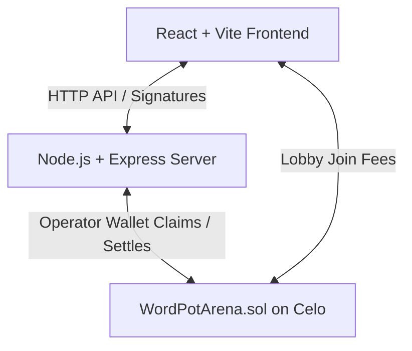

# WordPot (wordpit) Codebase Observation & Technical Analysis Report

WordPot is a mobile-first, Web3-powered word game built on the **Celo blockchain** and optimized for **MiniPay**. It allows players to compete in timed word-construction rounds, stake CELO tokens in multiplayer lobbies, claim daily onchain rewards, or practice for free.

Below is a detailed analysis of the workspace structure, codebase patterns, contract mechanics, and product insights.

---

## 1. Directory Structure & Architecture

The project consists of three main components: a React frontend, an Express backend, and Hardhat-based Solidity smart contracts.

* **`client/` (Frontend)**: A React application bundled using Vite.
  * **`src/components/screens/`**: Contains the core game screens:
    * `daily-challenge.jsx`: Interface for the timed daily reward challenge.
    * `practice-screen.jsx`: Free mode screen with no wallet connection required.
    * `game-screens.jsx` & `meta-screens.jsx`: Multiplayer room lobbies, gameplay HUDs, and end-of-round leaderboards.
  * **`src/styles.css`**: Holds global CSS, which is being migrated toward a premium dark theme matching the Daily Challenge.
* **`server/` (Backend)**: A Node.js + Express API server.
  * **`src/index.js`**: Core entry point containing API routing, room states, session handling, signature verification, and rate limiting.
  * **`src/rounds.js`**: Core game logic. Generates target source words, validates player submissions, and connects to the **Datamuse API** for word lists with local text file fallbacks (`english-words.txt`).
  * **`src/wordpot-contract.js`**: Web3 provider wrapper for Celo blockchain operations.
* **`contracts/` (Smart Contracts)**: Hardhat Ethereum development environment.
  * **`contracts/WordPotArena.sol`**: Escrow and payout contract.

---

## 2. Key Codebase Observations

### A. Game Mechanics & Validation (`server/src/rounds.js`)
* **Difficulty Modes**: Supports three difficulty tiers (`easy`, `medium`, `hard`) governed by specific letter constraints, length limits, and answer pool densities.
* **Letter Verification**: Uses a character-frequency check to guarantee candidate words only utilize letters present in the parent source word.
* **API Integration & Fallback**: Retrieves dictionary words from the Datamuse API. To ensure robust offline capabilities and reliability, it implements:
  * Exponential backoff and retries.
  * Promise deduplication to prevent concurrent duplicate API requests.
  * Local dictionary backup reading (`english-words.txt`, `/usr/share/dict/words`).

### B. Multiplayer Room Lifecycle & Escrow (`server/src/index.js`)
* **Quick-Match**: Matchmaking system that dynamically finds open waiting rooms or spins up new ones.
* **Background Setup**: To eliminate blockchain latency for the user, when a room is created, the server initiates the onchain Celo contract room initialization in the background so players can enter the lobby immediately.
* **Lobby Cleanup**: A background interval runs every 30 seconds to expire empty or inactive lobbies after 4 minutes.
* **Concurrency Locking**: Implements a TOCTOU-safe (Time-of-Check to Time-of-Use) join protection map to prevent double-joining from rapid clicks.

### C. Smart Contract Escrow (`WordPotArena.sol`)
* **Escrow Pot**: Players deposit an entry fee (e.g., 0.001 CELO) directly into the contract via `joinRoom`.
* **Treasury Cut**: Takes a percentage-based cut (e.g., 10%) on room settlement, routing it to the treasury address.
* **Proportional Payouts**: Distributes the remaining reward pool dynamically among players based on their score fraction:
  $$\text{Payout} = \frac{\text{Player Score}}{\text{Total Room Score}} \times \text{Reward Pool}$$
* **Refund Escrow**: If a lobby fails or gets cancelled, `cancelRoom` allows the operator to refund all deposited player funds onchain.

### D. Security & Optimization
* **Signature Verification**: Uses `viem` (`recoverMessageAddress`) to verify cryptographic wallet signatures. This prevents session hijacking by validating that the requesting address matches the private key holder.
* **Rate Limiting**: Differentiates limits between default endpoints (120 req/min) and sensitive blockchain endpoints like Daily Challenge submissions (20 req/min).
* **Gzip Compression**: Dynamically compresses Express JSON responses larger than 1KB, optimizing performance for mobile connections in developing markets.

---

## 3. Product Roadmap & Growth Plan

The workspace contains a strategic blueprint (`wordpot_growth_plan.md`) tailored to drive user acquisition in MiniPay's main target markets (Nigeria, Kenya, Ghana, Uganda):
* **Technical Enhancements**:
  * One-click social sharing intents for WhatsApp and Telegram.
  * Smart contract referral systems where referrers get a cut of the treasury fee.
  * Push alerts/Telegram bot integration to notify players when lobbies fill up.
* **Go-To-Market (GTM)**:
  * MiniPay DApp Directory submission.
  * Subsidized tournament lobby pools ("WordPot Happy Hours").
  * Campus micro-influencer events with pre-funded prize pools.
